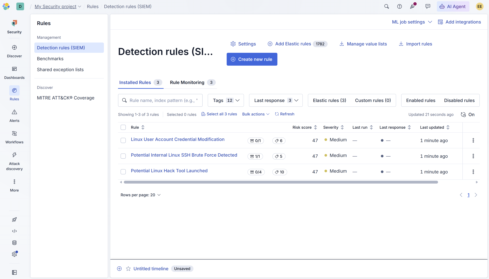
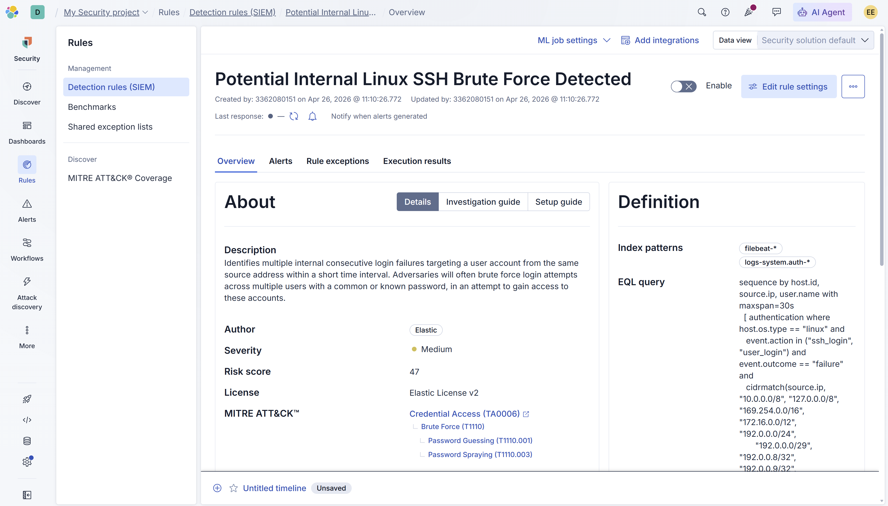
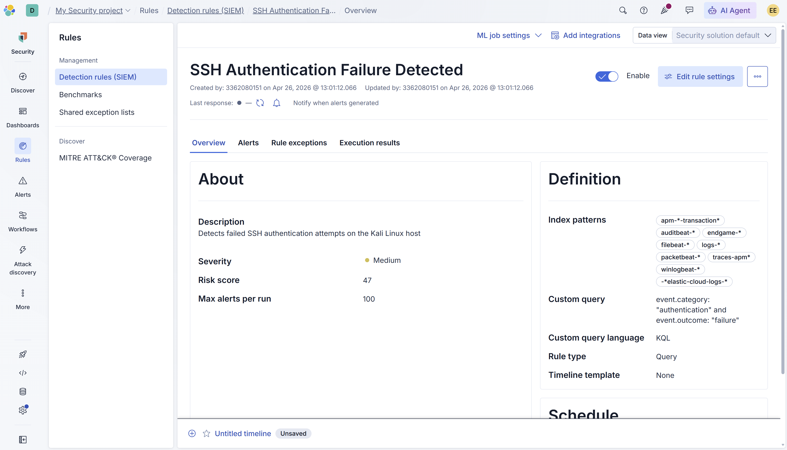

# SOC Lab 12 — Elastic Detection Rules

## Table of Contents
1. [Executive Summary](#executive-summary)
2. [Incident Ticket (ServiceNow Simulation)](#incident-ticket-servicenow-simulation)
3. [Lab Objectives](#lab-objectives)
4. [Environment Overview](#environment-overview)
5. [Detection Workflow](#detection-workflow)
6. [Rules Configured](#rules-configured)
7. [Detection Engineering Insights](#detection-engineering-insights)
8. [Evidence](#evidence)
9. [Conclusions](#conclusions)
10. [Next Steps](#next-steps)

---

## Executive Summary

This lab documents the configuration and deployment of detection rules in Elastic Security to identify malicious activity on a Kali Linux host.

Detection rules are the core of any SIEM platform. They define the conditions under which the system generates alerts, enabling analysts to identify threats in real time. Elastic Security provides both prebuilt detection rules mapped to the MITRE ATT&CK framework and the ability to create custom rules tailored to specific environments.

In this lab, three prebuilt Elastic detection rules were installed and enabled targeting Linux-based attack techniques. A custom detection rule was also created to detect failed SSH authentication attempts. This lab builds on the SIEM foundation established in Lab 11 and transitions the environment from log ingestion to active threat detection.

---

## Incident Ticket (ServiceNow Simulation)

**Incident ID:** INC-0012
**Date/Time Detected:** 2026-04-26 11:10
**Detected By:** SOC Analyst (Lab Simulation)
**Severity:** Medium
**Category:** Detection Engineering
**Subcategory:** SIEM Rule Configuration

---

### Short Description
Detection rules configured and enabled in Elastic Security targeting Linux credential access, SSH brute force, and hack tool execution. Custom rule created to detect SSH authentication failures.

---

### Detailed Description
Three prebuilt Elastic detection rules were installed targeting high-relevance Linux attack techniques including credential modification, SSH brute force, and hack tool execution. Each rule is mapped to the MITRE ATT&CK framework providing structured context for alert triage.

A custom KQL-based detection rule was created to identify failed SSH authentication attempts on the Kali Linux host. The rule queries for events where the category is authentication and the outcome is failure, enabling detection of credential-based attacks in the environment.

---

### Indicators of Compromise (IOCs)
- Multiple failed SSH authentication attempts to 127.0.0.1
- Invalid user login attempts detected on Kali Linux host
- Credential access activity consistent with brute force techniques

---

### Analysis
Detection rules were successfully configured and enabled. The prebuilt rules leverage Elastic's EQL engine and are mapped to MITRE ATT&CK Credential Access techniques including Brute Force (T1110), Password Guessing (T1110.001), and Password Spraying (T1110.003).

The custom rule uses KQL to query authentication failure events across all log sources providing broad coverage for failed login detection in the lab environment.

---

### Impact Assessment
- No confirmed compromise in lab environment
- Detection capability established for credential-based attacks
- Rules are enabled and actively monitoring ingested logs

---

### Response Actions Taken
- Installed 3 prebuilt Elastic detection rules targeting Linux attack techniques
- Created custom KQL detection rule for SSH authentication failures
- Simulated SSH brute force activity on Kali Linux host
- Verified rule configuration and query logic
- Documented detection engineering findings

---

### Recommended Actions
- Monitor alerts generated by enabled rules
- Tune rule thresholds to reduce false positives
- Expand rule coverage to include additional attack techniques
- Correlate alerts with endpoint telemetry for investigation

---

### Status
In Progress — Rules Enabled, Monitoring Active

---

## Lab Objectives

- Install and enable prebuilt Elastic detection rules
- Create a custom KQL-based detection rule
- Simulate attack activity to test detection coverage
- Understand MITRE ATT&CK rule mapping in Elastic Security
- Build detection engineering skills relevant to SOC operations

---

## Environment Overview

**Operating System:** Kali Linux (Virtual Machine)

**Tools Used**
- Elastic Security (Cloud Serverless)
- Elastic Detection Rules (SIEM)
- KQL (Kibana Query Language)
- EQL (Event Query Language)

**Network Setup**
- Kali Linux VM connected to Elastic Cloud
- SSH service enabled for brute force simulation

---

## Detection Workflow

### 1. Navigate to Detection Rules

Elastic Security Detection Rules were accessed via the Rules section of the Elastic Security dashboard.

---

### 2. Install Prebuilt Elastic Rules

Three prebuilt detection rules were selected and installed targeting Linux-based attack techniques relevant to the lab environment.

---

### 3. Create Custom Detection Rule

A custom KQL-based detection rule was created using the following query:

**Query:**

**Rule Settings:**
- Name: SSH Authentication Failure Detected
- Severity: Medium
- Risk score: 47
- Rule type: Custom query
- Query language: KQL

---

### 4. Simulate Attack Activity

SSH brute force activity was simulated on the Kali Linux host by generating repeated failed authentication attempts against the local SSH service.

**Commands used:**

```bash
sudo systemctl start ssh
ssh invalid_user@127.0.0.1
```

Multiple failed password attempts were generated to trigger detection rules.

---

### 5. Monitor Alerts

The Elastic Security Alerts dashboard was monitored for rule-generated alerts following the attack simulation.

---

## Rules Configured

### Prebuilt Rules

| Rule | Severity | Risk Score | MITRE ATT&CK |
|------|----------|------------|--------------|
| Linux User Account Credential Modification | Medium | 47 | Credential Access |
| Potential Internal Linux SSH Brute Force Detected | Medium | 47 | Brute Force (T1110) |
| Potential Linux Hack Tool Launched | Medium | 47 | Execution |

### Custom Rule

| Rule | Severity | Risk Score | Query Type |
|------|----------|------------|------------|
| SSH Authentication Failure Detected | Medium | 47 | KQL Custom Query |

---

## Detection Engineering Insights

- Prebuilt Elastic rules are mapped to the MITRE ATT&CK framework providing structured context for alert triage and investigation
- EQL (Event Query Language) enables sequence-based detection — identifying chains of events rather than single indicators
- KQL custom rules provide flexible detection coverage for environment-specific threats
- SSH brute force is one of the most common attack vectors against Linux systems and is a high-priority detection use case
- Detection rules must be tuned to the environment to minimize false positives while maintaining coverage of real threats
- The combination of prebuilt and custom rules provides layered detection coverage aligned with defense-in-depth principles

---

## Evidence

All screenshots are stored in the repository and demonstrate detection rule configuration and custom rule creation in Elastic Security.





---

## Conclusions

This lab successfully established detection engineering capabilities within the Elastic SIEM environment. Three prebuilt rules targeting Linux attack techniques were installed and a custom KQL rule was created to detect SSH authentication failures.

The lab demonstrates the ability to configure, customize, and document detection rules — a core SOC analyst skill. By combining prebuilt rules with custom detection logic, analysts can build layered coverage tailored to their specific environment and threat landscape.

---

## Next Steps

- Lab 13: Elastic Attack Simulation & Alerting
- Generate confirmed malicious activity to trigger alerts
- Triage and investigate generated alerts
- Document the full detection-to-response workflow
